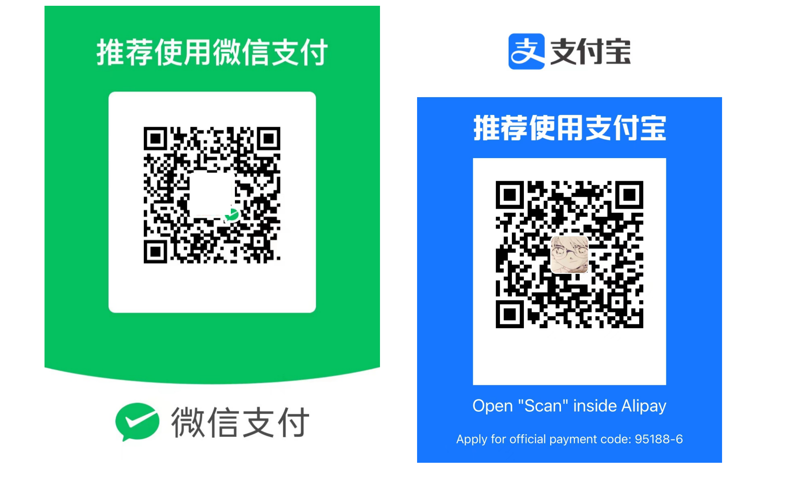

<figure markdown>
  { width="600" }
</figure>
# Chapter 0. Write the words before

## 0.1 Docs statement

** Statement **

This Docs was written by dozens of authors of interest, and the copyright belongs to the editorial board. In the process of writing this book, we have always been based on the principles of "neutrality" and "public benefit" and have not accepted any form of support from any other organization. Without the permission of the editorial Board, no organization or individual shall copy, reproduce, extract or modify the contents of this book in violation of the relevant copyright regulations; This book may not be used for commercial purposes; The original intent of this document may not be misinterpreted, modified or distributed widely without authorization. This Docs is a collection of more than twenty separate articles. Each section is written by a different author. In preparing the Docs, the authors listened to a large number of students' opinions and ideas, and tried their best to unify the various ideas under the framework of the manual. The purpose of this is to convey more ideas and opinions to readers for reference.

This Docs does not constitute any express recommendation for action and therefore the author does not accept any liability derived therefrom. The authors of this Docs cannot guarantee that the content of the manual is free from misunderstandings and bias towards other organizations. The content of Docs has not been reviewed for correctness and the manual author cannot guarantee that the methods in Docs will always work. The author of Docs is also unable to confirm whether the manual violates the various laws and regulations of the reader's locality, and readers are referred to local administrative regulations. In case of violation, please stop reading and immediately destroy any copies of the manual. The author is not responsible for any problems caused by the unauthorized dissemination of Docs. The author of the manual cannot determine whether the contents of the manual will have an adverse effect on the physical and mental health of the reader. If you are under the age of 18 or experience discomfort from reading the manual, stop reading it immediately and consult a psychologist.

The editorial board of this book welcomes your advice. If you have any questions or comments regarding the contents of this book, please contact us at [falcary@foxmail.com](mailto:falcary@foxmail.com). We do not guarantee to respond to every email, but we will carefully accept and consider your comments and make improvements in subsequent versions.

This collaboration address is: [AI Lab of DUT] (https://ujsosoymgz.feishu.cn/docx/LX8ldzcqCoB11GxCFDGcogFAnie?from=from_copylink)

## 0.2 Docs Preamble

** Preface 1**

The idea of writing this docs 💡 came from the flight from Dalian to Shenzhen. At that time, I thought it was necessary to make a summary of my university years, and then I directly started thinking about how to write this docs.

I accidentally chose the major of artificial intelligence in the summer vacation of 2021. At that time, I almost abandoned all of them (almost all my good friends chose other majors and moved away to five houses) and came to this major that I was completely unfamiliar with and began to develop. At the beginning, I was very confused and confused. Because I had almost no contact with anything in artificial intelligence in my freshman year, except for learning python in a shallow way and having a high GPA, I had almost nothing in other competitions. In my sophomore year, I was afraid of falling behind others (especially the students who changed their major, who were really fierce and excellent), and basically made a perfect plan for myself. In addition, we are a new major, and there are no resources left by seniors and seniors like computers and information and communication. Basically, all the exams except the key points of the teacher's exam, the rest are made by myself and students together. So that's when I started making up my mind and moving forward.

The purpose of writing this docs is mainly to let more students understand the research direction, learning style and future prospects of Dagong AI, etc., aiming at passing on experience rather than providing resources, there is a strong subjectivity, I hope readers can distinguish and find their own way.

In the subsequent stage, in order to avoid the "elite" effect of this document, I invited friends from different grades, different grades, different majors and different colleges to write together to ensure the details and professionalism of the document content. Thank them very much for their contribution to this docs 🎉, and also thank Lei Brother, Tang Tang and other seniors and friends for their help and support. I hope that the AI and electrical professional development of the university is getting better and better, and I also hope that everyone can compete healthily and help each other.

Since this article is coordinated by many people, if the content infringes on your interests, please delete the contact information at the end of the article, thank you 🙏 if you think this article is helpful to you, please slide to the end of the article and click a "like" 👍, thank you

** Preface 2**

In the three years of life in Dalian University of Technology, I witnessed and experienced too much absurdity, too many mistakes, too much confusion, too much helplessness, too much failure, behind everyone's success hidden day and night pay and torture. High school graduates who think they are the favored ones of God, standing on the threshold of college, can sometimes appear as naive as young children. The young students are also proud of their youth, which is full of infinite possibilities, but they have not realized that the only white paper in life can not be daubed at will. This book hopes to set up a correct outlook on life and values for students, and provide practical suggestions on specific policies to help those aspiring young students improve themselves and realize their inner pursuits. Looking back on my four years in college, I have always retained a strong devotion to scientific knowledge. This piety forced me to rethink what was supposed to be "normal" everyday life, and this piety forced me to stand up and pursue what I thought was right.

> * Learn to fear, learn to be humble, learn to be peaceful and persistent, modest and fearless! *

Here, my partners and I have recorded our three years and life struggle bit by bit experience and sentiment, on the one hand, I hope I can do some duty for those who like me in the depression of the soul. On the other hand, I also hope that this book itself can become a driving force to promote the progress of various unreasonable systems.

Reality is always a pity. Too many of us have gotten used to following the same "typical path to success" : high school entrance examination, college entrance examination, postgraduate entrance examination, going abroad...... Bury your head in the road. Those who walk in front are lost, those who follow behind have not yet begun to think. This should not be the spirit of a country or an era.

This book is not a "Skipping class handbook" or a "pre-exam shock book", more like a "summary of experience". What I hope to help you do is not simply to get high grades or graduate. I sincerely hope that this book can bring readers some fresh thinking, so that students can see a different scenery on the road of life, so that the students of the whole major are struggling for their own ideals and goals. After reading this book, at least, you should have the courage and wisdom to find and challenge pursuits that are more important than taking classes, getting good grades, or winning scholarships.

** Preface 3**

In the process of website construction, I referred to the experience of many universities such as Peking University, Tsinghua University, Jiao Tong University, Zhejiang University, University of Science and Technology and other student-run websites, thank you for the hard work of contributors, but I can't help but fall into a deep thought, each school more or less has some open source warehouses for sharing experience, but there are very few on the Dagong side. In Dagong, I was always afraid of sharing, although I always convinced myself in my mind that "daring to share is not a sign of strength, but a proof of courage." Because I am afraid that my sharing will be seen as showing off by others, and it is not necessarily right to convey different values to others. However, after all, I completed nearly 80% of this document and open source it, hoping to help students to see things beyond their own age to a certain extent, and I also hope that future AI people can actively share their various experiences, spend less time in the professional course exam, laboratory class report "intriguing", and more sincere communication with people around. We must believe that "go together, go further" this truth, truly peaceful and persistent, modest and fearless!

**⚠️ Note: **

This paper is biased towards the understanding and interpretation of electrical or AI majors, hoping that students of different majors can obtain part of the information they need from it.

Who is this book for

Any friend who is interested in self-learning computer and artificial intelligence can refer to this book, if you already have a certain computer and artificial intelligence foundation, just interested in a specific field, you can selectively choose the content you are interested in learning. Of course, if you are a little white who knows nothing about computers like me, and just entered the university, I hope this book can be your guideline, so that you can spend the least time to master the knowledge and ability you need. To some extent, this book is more like a course search engine sorted according to my experience, helping everyone stay at home to experience the world's top schools of computer and AI quality courses.

Of course, as an undergraduate who has not yet graduated, I feel that I do not have the ability or the right to promote a way of learning. I just hope that this material can help those friends who have the heart and perseverance of self-learning to take fewer detours and gain a richer, more diverse and more satisfying learning experience.

At the same time, this book will also share the learning experience of major industrial and electrical majors over the years (including postgraduate entrance examination, postgraduate qualification, etc.), and there will also be a brief introduction of some activities, aimed at helping new children adapt to college life as soon as possible, I hope it will be helpful to you.

## 04. You also want to join the ranks of contributors

After all, the power of a person is limited, and this book was written by me in the spare time of heavy scientific research, so it is inevitable that there are some imperfections. In addition, because the individual is doing the system direction, many courses focus on the system field, for mathematics, theoretical computers, advanced algorithms related content is relatively less. If you want to share your self-study experience and resources in other fields, you can directly launch a Pull Request in the project, and you are also welcome to contact me via email ([falcary@foxmail.com](mailto:falcary@foxmail.com)). If there are not enough managers to contact the author for document operation and maintenance within six months (before 2024.02), I will give up the renewal of this domain name.

## 05. Special thanks

Special thanks to all the friends ** who participated in the writing of this docs, thanks to a great senior ** of Peking University Information Science Department ** for sharing the open source, and sincerely thanks to all the teachers who open source the course resources for free. These courses have invested their decades of teaching career accumulation and effort, but they have chosen to selflessly make such a high quality CS+AI education available to everyone. Without them, my college life would not be so full and happy.

I hope that anyone reading this book will be grateful to the engineers, teachers, and former students without whose help it would not have been possible to complete the docs. At the same time, I also hope that the people who use this book, ** stay humble, not impetuous, not selfish and proud, and help each other **, good luck!

Invite the author to a cup of afternoon tea

The content of this book is completely open source and free, if you feel that the project is really helpful to you, you can order the warehouse star or invite the author to have a cup of afternoon tea.

------

<!-- Google tag (gtag.js) -->

