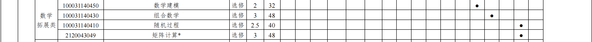
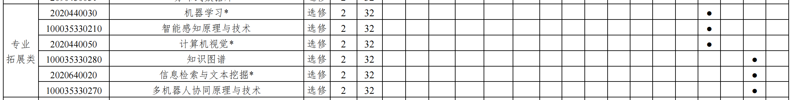

# Chapter 3 活在大工·生存技巧大合集

##  3.1 课程选择

 大体上来讲，课程选择基本还是给大一和大二的同学准备的，大三的时候很多课程基本只有一个老师，所以也不需要怎么抢。由于对老师的评价主观性很强很强，此部分更多的提供一个参考功能，希望能对你有所帮助，当然如果你想添加对于部分老师的评价，可以通过飞书文档自带的评价添加方式进行补充。

### 3.1.1 ⭐官方选课操作

​	[文件下载网址](https://pan.baidu.com/s/1YfM7YaFE6ez1wY9NNJ3pMA?pwd=jd8d)

### 3.1.2 ⭐大类课程选择

​	此部分详见资料分享部分

### 3.1.3 ⭐英语课程选择

| 授课教师              |                                                              |
| --------------------- | ------------------------------------------------------------ |
| 田素萍                | 作业多事多给分玄学，非酋很可能轮上低分，可能会拿阳寿换分，慎选；给分相对客观，比较严格 |
| 安雪花                | 非常好，没有多余作业，上课不点名不提问，只有一个u校园内容必做，平时分给分非常好，老师温柔美丽事情少，无脑选就完事。推荐 |
| 牛晓春                | 每节课后都会有学习通的作业，而且很多题都是自己出的，没有答案，上课教材教的比较快，会讲一些自己总结的，给分还行 |
| 李雪艳                | 老师人很好，学习通比较多还有几个听力但是可以重做，上课会提问有小组环节但是不难，给分还行 |
| 夏晓梅                | 外院三梅之首，学不到东西管的严给分还低，避雷。               |
| 张静                  | 老师人不错比较温柔细心，作业还可以，给分也还可以。推荐       |
| 韩虔                  | 老师贼好，讲课好，给分高，平常也不严                         |
| 战丽莉                | 讲课较为严谨认真，我上课睡着了还给我披衣服，给分一般         |
| 吴启竞                | 上的是她的辩论性写作。管的不严，上课也不盯着你。（一个认识的朋友上课睡着了传到他回答问题，答非所问了也没挨骂）作业不算多，就是让写作文。期末给分挺高的，90+好像在老师里算多的，平时听听课期末前复习下重点的话能拿更高的分。推荐 |
| 谭芳                  | 有人评价其非大英课：教学严格，个人风格严谨，平时划分的很细，上课喜欢提问，很难划水，不过可以学到东西。 |
| 吴卓娅                | 总体较好，给分也比较高；需要总做presentation，口语情景交际期末占10分，分档给分。比较推荐 |
| 朱德全                | 老师很好，很负责任，给分90+的很多，讲的也好。推荐            |
| 王梓晗                | 老师很温柔，上课会点名回答问题，作业稍微有点多，给分较高，颜值神级存在。 |
| 陈丽辉                | 上课比较水 老师不严肃 但是每节课会有一次提问 有学习通任务和5次小测 小测不太监考 网上能查到 |
| 鲍倩                  | 测试多，要课前预习，学习通为主，本人最后86；不太建议选吧，毕竟有人说选鲍倩就很抱歉 |
| 徐莉                  | 事比较多，有测试，但是上课很水，有没有作业不一定，我上的时候一学期都没有，我室友上的时候天天留，给分不是特别高 |
| Stephen Andrew Noshie | 上课完全英文，一走神就会听不懂，讲各种应用文体，会留课下作业，课上没有小测，有点名和提问，最后考试写好几篇作文，给分还可以，不会很高，本人86。分数也不会太低。大英二可选的目前好像确实比较少，所以还是推荐一下。 |
| 张雪梅                | 除了演讲的准备任务，没有作业。给分正常                       |
| 尹柔茜                | 人真的超级温柔漂亮，咱上大英课不图学到啥，就图上的舒坦；给分也很好，耐心给学生划重点（语音）推荐 |
| DiLi                  | dili为什么是神？杠精，政治方向或多或少有点问题，不听课还好，管的松，给分低，能不选就不选。 |
| 王爽                  | 这个老师的大英四推荐的比较多，其他的应该也不差               |
| 崔大志                | 上课提问，给分较高，平时分也很高，很负责的老师；教过的学生她都记得。推荐 |
| 姜怡                  | 上课超级好，有测试但是不计入成绩，没有作业，只有预习，考试给分高。推荐 |
| 钱进                  | 事多，给分还行                                               |
| 李秀英                | 老师很好，给分比较高，平时事情可能会多一些，但检查并不严格。比较推荐 |
| 孙丽                  | 给分高，讲课认真，为了教会学生而教，不压分。推荐             |
| 马英伟                | 人超美又温柔，给分高，每周会有作业，上课会提问，不过不严格，推荐！推荐 |
| 张艳敏                | 上课前会有雨课堂扫码签到，讲课语速偏慢，内容质量一般，有时随机提问，会有关于艺术家及作品的演讲展示；给分客观，比较严格。不太推荐 |
| Jason                 | 老师很不错，给分高+事情少，推荐                              |

### 3.1.4 ⭐体育课程

- 推荐：**王健壮**（给分极高），**张钰**（乒乓球选就行了），**曹厚文**（给分高，上课有点累），**徐东**（想健身的跟着选就行），**韩飞**（老师人特别好，请假很方便，给分高，调课也同意），**杨树叶**（给分高，但是每节课得压腿半小时以上），**杨雨龙**（每节课教半小时，剩余时间自己练习，给分特别特别高，空闲名额还有很多，必选），**白文**（上课特别轻松，给分也很高，如果只想玩玩可以），**李岩泽**（技术水平特别高，适合有一点基础的人学，期末高远球对打给分；如果是大二or大三选择，分数相对来说较低，总体课程很不错）**宋鸽**（有就冲，让你体会什么是神），**李苏恒**，**航概**（排球课，推荐女生选，压力小，给分高），**王铮**，**丁梦琪**（老师人特别温柔特别好），**王洁群**（听说也特别好），**朱焱**（当时上的羽毛球课，除了考勤会比较严格，其他都挺好了，老师也比较快乐），**姜勇**（上的事老师的体能课，比较轻松）
- 刘海斌，霍玉聪，刘健松，高峰杉（男生别选），王生光（给分总体不高，但是课程压力也不大）
- 避雷：刘君，王俊杰，朱振楠，王晓楠，王磊，赵志男，陈哲夫

### 3.1.5⭐AI 课程选择与学习建议

------------ 大二学年课程 ------------

【大二第一学期】

**1.** **模式识别与机器学习**

Ans1:难度感觉挺大的，刚上大二看到满是公式推导的PPT的就有些无力感，也是AI课程的基石，重要性不言而喻，只能说，好好学，认真学！刘倩老师和李祎老师都挺好！徐易老师不太清楚捏，Project挺有挑战性的，总而言之，超越自我。这门课很硬核，以理解为主。

**2.** **模式识别与机器学习实验**

Ans1:实验课是结合理论课一起开的，感觉挺有意思的，学的东西也是比较前言的，有实际背景的，可以参考一本书《机器学习实战》。

**3.** **最优化方法**

Ans1:这门课有点抽象，张平平老师科研很强，但是讲课有点不好评价，最开始会说好是考原题，把作业题自己认真写一遍，PPT上的题目过一遍，应该问题不大。建议还是好好学，因为机器学习太多最优化了呜呜呜。

**4.** **人工智能程序设计**

Ans1:这门课，不知道说些什么了，孙焘老师很摆，学不到东西，要学C++和Python建议自己学，听课没啥用。然后老师最后考试是机考，考的差不多是菜鸟教程上的题目。

**5.** **概率论与数理统计**

Ans1:这门课是经典的数学课，数一必考的，感觉李广伟老师很好，讲课也不错，概率论也得好好学，和后面机器学习又很大关系呜呜呜，到概率图模型等用的很多，比如高斯分布、先验概率等等。

**6.** **人工智能导论**

孟军老师的课，PPT战神，不好评价，考试就考PPT，很抽象，PPT还多，不好学，感觉，一上来就各种算法，深度学习机器学习，很多听不懂，但最后考试就靠背。

**7.** **马克思主义基本原理**

Ans1:这个课程，老师挺好的，最好口试，分数会高些，笔试难度挺大的，不好拿高分。

**8.** **大学物理A2**

Ans1:大物的话，比大物A1知识点要多一些，因为高中学的更多的是A1的部分，因此最好一直跟上，从光学到近代物理，知识点还是很多的，复习起来有点麻，平时作业自己写。老师的话，张佼老师YYDS！

【大二第二学期】

**1.** **电子技术**

Ans1:这门课挺难的，电智学时还少，最抽象的就是模电，模电考试也挺难，数电和FPGA考试的话，题目比较简单，难度不大，所有别担心，听不懂不影响考好，但是最好跟上老师的进度，尤其模电，八九周的样子就会考试。

**2.** **计算机组成原理**

Ans1:这门课所有专业都差不多，但是人工智能学时稍微少几个，没有实验了。好好学，听王道考研，考研408，挺重要的一门课

**3.** **离散数学**

Ans1:这么课感觉挺有意思的，但是电智难度降低了，没学群论，但是图论这块还是有难度的，建议好好学，一开始把作业做好，最好好好复习一下。挺抽象的一门课，但是对后面数据结构的学习很重要。

**4.** **深度学习**

Ans1:这门课主要考PPT，感觉把PPT多看几遍，理解好几个基础的神经网络，还要一些经典的模型就好。难度比机器学习小多了，很多概念题，以背为主。

**5.** **深度学习实验**

Ans1:实验挺有意思的，能学习一些较为前沿的知识，自己动手搭建网络，感觉很好玩。实验周期很长，但是建议早点做，拖到后面有几门八周结课的考试，所以还是提早完成。

**6.** **毛概**

Ans1:PPT展示汇报，还有机考。和近代史类似，不再赘述。

【大二第三学期】

**1.** **脑认知与科学**

Ans1:这门课很有意思，但是老师讲得可能有点乱，建议好好听老师讲的考点，然后课下整理好。学的一些神经科学认知科学的知识，还有大脑结构，知识点挺多，以背为主。

**2.** **电子技术实验**

Ans1:很麻。事情很多很多，六个实验，间隔还短，全挤在一块了，期间还得准备考试和硬件设计。运放和振荡器实验得去实验室，FPGA两个实验要验收，老师会检查和问问题，数电组合逻辑和时序逻辑线上用Vivado做，要交报告。

 

**3.** **智能硬件创新实践**

Ans1:【2021】很麻，21级做的是四旋翼，时间太紧张了，最后一周验收，应该没人做出来无人机，最后大部分都是做到遥控器。分为硬件部分和软件部分，硬件部分2周，软件2周，硬件一定要自己画原理图和PCB，老师会查重，硬件部分（40分）验收看得挺重的，会放大很仔细地看组内甚至组间的PCB和原理图是否一样，有可能问怎么设计的PCB之类的，软件部分（40分）看你实现了什么功能，会问问题，可能会看代码，让你解释，还会看看报告，李老师会现场记录每个小组的验收情况，可能是给硬件和软件部分当场打分，报告（20分）后续批改这样子，做好被拷打的准备。

 

Ans2：【2020】开课的第一年，这一年李诗人还是比较友好的，我们做的是基于STM32F106的板子，任务是（如下图所示）。我的评价是，感觉老师不会教你任何的底层知识，基本全靠自学或者寻求会32的同学的援助。最后的任务也是通过绘制PCB、实现逻辑编程（包括串口通信、LCD展示、中断等等），有一定的难度，同样也要做好被拷打的准备。

------------ 大三学年课程 ------------

【大三第一学期】

**1.** **智能机器人**

ANS1：雪涛老师讲得还行，但是部分公式推导的东西比较难以听懂，20级是没有考试，最后是两次平时作业+最后的论文复现以及报告。课程整体来说比较抽象，对数学的功底比较高，如果想要做嵌入式方向或机器人的，可以在假期之前提前学一学，这边推荐《概率机器人》这本书。

**2.** **智能机器人实验**

ANS1：李华龙老师的课也比较轻松，四次任务+最后验收，按照机器人的部署情况进行打分，跟着好好做一般没啥大问题，可以提前学一学linux+ros，并装好虚拟机或者双系统。

**3.** **博弈论**

ANS1：笔者上的费老师的课，个人觉得费老师相当不错，人比较有趣而且学术能力也比较强的。课程内容的话，主要还是以概念理解+公式推演等等，按照教材和ppt走的，难度不大。期末考试是名词解释+简答题+计算题。

**4.** **计算机视觉基础**

ANS1：笔者上的王立君老师的课，课程比较完善，作业难度也不大、课程难度也不大。最后考试的时候也是记忆的居多。

**5.** **数据结构**

**6.** **操作系统**

ANS1：这俩听课也可以、不听也可以，反正听课了之后我觉得还是得过一遍考研408，这样复习才比较全面。当然学有余力的同学可以上Leetcode刷刷题，这个在今后的保研还是说复试的流程上比较有用。

**7.** **人工智能创新实践I**

ANS1：20级是讲的强化学习（Reinforcement Learning，RL），可以参考磨菇书，git上开源有，最终的作业任务是老师给项目题目或者自己选做一个大项目，然后最后交项目的code和代码，属于是自我发挥，比较容易。

 

【大三第二学期】

**1.** **自然语言处理**

ANS：杨亮老师是比较有意思的一个人，但是上课如果跟不上老师的节奏就会再也听不懂了。跟知识工程一样都是需要记住PPT的很多东西的，而且学的东西都比较传统，不会学Transformer这些，所以想要往NLP方向走的同学，这门课最多是让你了解一下nlp的发展以及传统nlp的处理方法。

**2.** **知识工程**

ANS：老师上课讲不清楚+学不懂，最后考试的东西全是什么年份、提出了什么，感觉这门课上的没啥意义，全是背的东西，最后因为忙保研啥的，摆烂了。建议直接背诵，记住关键节点，然后就完事。

**3.** **NLP实验**

**4.** **知识工程实验**

ANS: 上面两个实验都是由王翠老师上课，课程内容比较简单，难点其实是知识工程最后知识图谱的自主设计+问答系统的设计，主要是设计+后处理比较难，整体比较轻松，需要提前熟悉一下neo4j这个图结构库。

**5.** **CV实验**

ANS：笔者选的傅老师，基于jetbot小车+nano做的视觉任务，一般都是视觉+机器人+其他方向整花活hhh，2周时间之内完成任务，如果不做太难的问题，时间是相当充裕的。

**6.** **人工智能创新实践II**

ANS：龙哥的课，yyds，做的是基于深度相机的苹果抓取。讲的比较清楚+最后整个实验流程的验收也比较有趣。每一节课都会推动项目的前进，比较有成就感，最后还有一个对抗性比赛，这个就比较随缘了，看每组都是如何保证算法稳定性的hhh。

 

**注：AI这边，20级，5.1之前所有的理论课考试都结束了，所以相当于有接近2个月来准备保研的事情，相对于计算机和信通都比较舒服hhh。**

【大三第三学期】

**1.** **生产实习**

ANS：与大连人工智能计算中心合作来上的课，基于华为Mindspore来做一个实训项目。整体而言，共四周，一周一节课，对于保研er比较友善，最后老师会提供项目来完成，也可以自己选，相对来说比较容易，五人一组。

##  3.2 考前复习

> 3.2.1 - 3.2.4 沿用的是 SJTU 的版本，并进行了少量修改，并在后续添加了个人理解。

 新书或者根本没买过书；没听过讲，或者没上过课，没独立写做过作业甚 至没交过作业，但是离考试只有三天时间，这样的情况，对我们中的大部分人，对大部分课程的考试，并不意味着绝望。只要你有心，三天造十万 支箭都没有问题，更何况考试？

 笔者并不是一个“优秀”的学生， 因为在大学四年内， 我没有一个光鲜的 GPA 。虽然我可以很骄傲地说，这四年，我把本该上课的时间用来做了更重要更有意义的事情。但是面对考试能拿到一个过得去的分数也是我的底线。我相信，并不是每个同学都会很乐意的接受挂科、甚至退学这样的经历。

 并不是所有同学都能够像我一样幸运地找到一些比上课正确一百倍的事 情去做。而我们在这一节里分享的，更多是拿到 70 分而不是 90 分的经验。 如果你在阅读本 Docs Chapter 1 之后，你的目标仍然是得到 90+。或者说， 你找不到比上课更有意义的事情，那么你们应该去自习室，而不是在这里听我扯淡。

> *突击备考的一个必要前提是，我们把时间用来做了更重要的事情。*

从学习知识而言，上课是一件奢侈的事情。对突击复习考试而言，所谓的“慢工出细活” 也是奢侈的。如果你认为这门课不重要，请不要在两个星期以前开始复习，因为两个星期足够让你忘掉其中一大半的知识。通常，有效的复习是在 5 天之内开始的， 因人略有差异。我不否认个人之间的 IQ 存在差异，但是这种差异是如此之小， 以至于甚至不能成为左右考试成绩的主导因素。充其量，有些同学可以以笨鸟先飞的名义，把一门课程需要的复习时间从 5 天延长到 7 天，不会更多。当然，我们这里说的是针 对大多数靠突击有可能能拿高分的课程。某些课程（诸如高等数学） ，显然是排除在我们的讨论范围之外的。一般一门课如果在历史上曾经挂了学院 1/3 以上的同学，那么对于该课程就需要提高警惕，慎重起见，甚至不要突击复习（比如模电=-=）。

 不过大二和大三都朋友们都会发现了，前期做的一些整理性工作还是有一定作用的，考试周安排的各个理论考试基本都是隔 1-2 天考一科，给复习会带来很大的压力。

###  3.2.1   注意复习范围

 通常老师在复习课上都会把考点和考试范围告诉大家。对考点的正确解读 可以让你事半功倍。比如，有一些脸皮比较薄的老师在划考点的时候，不喜欢明目张胆地说“这章不考”，而是会换一种更加委婉的说法，比如“这章的内容主要是介绍性的，有兴趣的同学们可以进一步拓展”。我相信大部分 同学对于这样的话都能有正确的理解。至于考点的准确性，我认为我们不 应该心中有任何疑问。虽然的确存在过老师说不考的地方真的考了，但是 那种事情出现几率非常低，每学年近二十科考试，能出一次就不错。而且 真的没复习到所带来的影响也不是决定性的。所以我们在考前最后一节课上，一定要毫无保留地相信老师、相信考点，并且，还要相信不同老师考点的交集。

###  3.2.2   五天冲刺

 五天之内，你需要准备的：

- 课本（没错，就是这门课的教材）
- 上课 PPT ，如果你的老师的 PPT 只是把教材原样照搬的话
-  一位懂得这门课程的朋友
- 平时作业列表
- 全书考点（或者不考的点）的列表

 首先，请懂得这门课程的朋友吃饭，让他用半小时的时间，用通俗语言，按章节给你介绍这门课是做什么的，每一部分的考点是什么。吃饭结束之后，和他约考试前一天下一次见面的时间。然后翻开教材，看目录， 将不需要考的内容划掉。回忆那位朋友的话，想象每一章的标题所代表的内容。以 3 倍速的速度将书翻一遍，无论看懂不看懂，进一步领会朋友所说 的话，如果是理工类课程，争取每章自己总结一个能够说服自己的理论。

 然后，找出平时作业列表，当然了，通常来说你肯定是一道题目也不会做。这 很正常，你不必为此感到紧张或绝望，不上课直接做作业本这本身就是让 人绝望的。你需要做的是，把作业和答案放在一起，开始扫荡，用半天的 时间保证你知道答案的那些数是怎么算出来的。注意：你没有时间一道一 道题目去做，把你高中老师告诉你的要扎扎实实的说法抛到脑后吧，扎扎 实实你应该好好上课去。

 如果顺利搞明白了作业，你现在大约可以考 40 分了。你会遇到一些情况， 比如作业题目你看不懂，你不知道答案上面那些鬼东西是在说什么。 勾上相关的章节。将刚刚勾过的章节逐一以两倍速浏览，注意看公式和黑 体字。你会发现你小学套公式， 中学套公式，到了大学，还是在套公式。 接下来你只需要把你不会的题代到相关章节的相关公式下，做好字母和中 文的对应翻译工作。

 现在你不会的题目应该很少了。这会儿开始看 PPT 。注意，不要一开始就看 PPT，知识是书上来的， PPT 是演讲稿，不要因为懒不去翻书。

 在考试之前前一天之内，把所有的公式或者解题步骤都写在一张纸上， 用剩下除睡觉之外的时间去熟悉这张纸，根据例题的形式在脑中按照这个套路演练。但是不要试图拿着这张纸作弊——风险太大回报太低不合算； 把上面的内容抄到桌子上也不可取。在考试时，你根本不会有机会去把桌面当图书馆查来查去，这样做只会让你心虚，一边惦记这个事儿一边浪费大量时间。考试的时候，尽量不要抄周围同学的，因为你周围的人复习的不一定比你好。

 如果你前面工作做的足够好，那你一定要有信心。题目要么你都会做， 要么大家都不会做。关于选择题，请尽量用你的大脑，不要胡猜。要记住 这是你和出题人 IQ 的比拼，而不是 rp 的比拼。

###  3.2.3   考试结束后

 一哭二闹三上吊是下下策，只有当其他的手段都无效时，再考虑这样的办法。对于某些老师，你唯一的选择就是考到 80+。对于另外一些比较好说话的老师，你可以跟他们谈谈你对课程的理解， 以及对这门学科的看法。 在谈话中，最佳的切入点是学术。你要尽可能地讨论学术方面的问题，而不是去强调你要出国，你要保研。  每个人都有各种各样的私人借口来要求一个好的成绩，但是这些借口并不一定都能成为让老师帮你一把的理由。

 另外，很多时候， 即使你的成绩单上已经是不合格了，也并不是没有办法的。 但请注意不要违反法律，不要出卖自己的尊严。

###  3.2.4   复习箴言

1. 请保证这几天时间 80%以上的利用率，睡觉也要尽量克制些。
2.  不要打游戏，如果考试跟电脑无关，尽量少开电脑。
3.  多参加专业群内的讨论。
4. 你可以总结出对这门课程的几个独创理论，比如你对某一章节的独特理解，分享这些经验，这会帮助很多人，推荐！！
5.  如果你有考点搞不太清楚，不要浪费过多的时间试图让自己“真的搞懂”。只要你能把解题步骤记牢，保证大部分习题都算对就是胜利。
6. 有一些课程没有习题，或者说老师布置的作业没有代表性，那你必须 需要去购买一本习题集，或者看别人的上课笔记
7. 做题一定要找有答案的，你没有时间去自己确定你做的每一个答案是 否正确。
8.  如果可能，把那些不是作业题的里面的一些有趣的内容也看一下。
9.  不要不去考试，无论如何，应该尝试一下。而且很有可能补考卷子和考试卷子就是同一张。
10. 考试结束后，无论感觉好坏，别忘了请辅导你的那个朋友吃饭。

###  3.2.5 如何考 90+

>  我猜不少朋友直接跳到了这里，不同的人有不同的学习方法，笔者自认为自己有着比较好的 RANK（1/87）和 GPA，希望我的方法对你有所帮助。

(待添加文件)

暂时无法在飞书文档外展示此内容

- **探索适合自己的听课-复习方式**

  -    有些人认为上课是自己的主阵地，有些人以网课作为自己的学习方式，各有所长。但听课的目的是在记忆层面上，加深对知识的理解，所以记录是必不可少的，而关于记录的方式在上面这个 PPT 里面已经说明很详细了。

  -    AI 这边的记录形式我觉得更多的还是以电子文档或者电子笔记（Goodnote、Notibility 等）为主，其有及时性、容易更改、便于归类和复习等优点，本人一般会将课程进行分类：基础数理类（高数、线代、大物等），专业理论类（数据结构、机器学习等），代码语言类（C、Python）：

  - - 基础数理类：采用 pad 进行记录，周末对于本周知识进行统一复习和整理，考试之前将笔记化繁为简，梳理知识架构，并结合习题查漏补缺。
    - 专业理论类：采用飞书 Docs 进行记录，上课时仍使用 pad 进行 PPT 标注，然后课后花 30-60 分钟把知识整理到云端平台去，在此期间会查阅上课没有懂的知识，并放在文档中，最后期末对于这个文档进行多轮复习。
    - 代码语言类：这个就没啥可说的了，多敲代码+记语法。

- **找到合适的复习资料**

  -    资料其实也是信息战的一部分，大学培养的能力之一就是信息获取能力。对于复习资料的获取，其一是通过直系的学长学姐要 TA 整理的材料，另一个就是自己在预习时或者理解知识点时，在网上收集到的资料。

- **如何向直系的学长学姐要 TA 整理的材料**
    > 你的学长学姐和你并没有直接的利益关系，能够和你分享资料基本都是为爱发电，希望能够把语气和态度放低一点，不要有那么强的”利用“意味。

    - 礼貌地表达意图。当然 TA 有拒绝的权利，如果被拒绝了也不至于对于学长学姐敌视，有可能是你某个地方没做对或者 TA 单纯地不想给。
    - 学会表达感激。可以给学长学姐买一杯奶茶以表达感激，更近一步也可以约 TA 出来面谈，也许会收获到更多东西。

- **自己整理复习资料**
    - 就像前面所提到地，使用飞书 Docs 进行记录，复习时就可以根据自己的理解增删改查，同时具有一定拓展性，在保研或者考研复试的时候说不定会有一些帮助哦。
    - 还有一种就是在 B 站、知乎、Zlibrary 寻找部分高质量的电子书或 blog 或视频进行浏览，有时候也会得到一向不好的效果。
    > 本人的复习方式往往是 120%的复习，哪怕只发挥了 80%，也能有 96%的效果 hhh，不过就是比较费时费力。

- **积极探讨问题**

  -    复习时不要想着一个人闷头干大事，拉上你的小伙伴（不必过多，1-2 个好），两个人在休息时互相询问复习中存在疑惑的知识点，说不定你不会的知识 TA 会呢，TA 不会的知识刚好你也会，这样效率就直接拉满了。

  -    同时，在讨论问题的时候会存在 Battle，会无意中将你的思维训练更加缜密，一定程度上会加强你的语言表达能力，一举多得。

##  3.3 实验 or 课程设计

###   3.3.1 常规实验

> 比如 电路 大学物理实验这种

  写实验报告的过程可以分成两种。

  第一种，是自掘坟墓的过程。在这个过程中，你会发现，自己的文笔有多差，因为报告都是抄的；会发现自己的字有多丑，因为缺乏思考一般是一字不漏的抄下来，边抄手就边抽筋，后果你们懂的；会发现实验数据在你面前就仅仅是数字而已，因为实验打了酱油；最后借别人的抄你会发现，你连抄都不想抄，因为要画好多图！当你下决心画图时，会发现找不到尺子，只能掏饭卡，拿起铅笔画时铅笔芯断了，而且是最后一根笔芯；最后你会感觉这个世界都在欺负你。这是一个可恶的恶性传递，会不断放大自身缺点，严重影响人的自信心。结果就是不断问自己为什么要做，可手却不能停。眼睁睁看着自己言行不一。

  第二种，就是作死的过程。明知道是个走程序的过程，老师不耐心，学生不用心，可却非要强求结果达到圆满。种下什么因就结什么果，老师负责作，学生只要负责累死哭死心死，最后脑细胞全部崩溃，写完后脑袋水的可以养金鱼了。

  所以不管是电路实验还是大物实验，都摆脱不了”抄“报告的命运，如何能”高效“的超报告纯看个人能力了。

> *ps：这种类型的实验报告必须存在，但它存在的形式出了错，这个责任，老师学生都有，要么都改，要么就蒙上眼睛得过且过吧。当报告成程序，实验就成了死物，当初做实验的目的就成了空谈。希望在以后大学生的眼中，写实验报告不会被吐槽，还能成为一件快乐的事。*

- 选课推荐

  > 大物实验

  - 1.秦颖(1989011038)：事情多，给分客观，特别严，及其讨厌抄数据。
  - 2.李建东(2004011129)：邪恶光头，分人给分，有的给分很高，有的很低，不推荐。
  - 3.王艳辉(1991011030)老师人还行，我记得好像会提问，但是问题不大，给分还可以（我水的 94），可以选
  - 4.戴忠玲(1989011027)：很好，给分高
  - 5.李会杏(2015011119)：给分高，特别好，有拖延症，考试周复习的时候会看见她在图书馆批报告
  - 6.刘升光(2011011080)：给分高，认真负责，推荐，这就是大物实验之光！
  - 7.王明娥(2016011020)：给分一般，水的表面张力，实验比较难，人还可以，给分中等偏上一点点；这个老师本身不错，就是做实验的时候讲的比较快，实验过程中也不管，但是磁滞回线实验给分很好，会挑数据结果，就是比较容易背刺你：突然换成其他老师，例如白亦真……
  - 8.吴兴伟(2016011005)：很好的老师，推荐
  - 9.刘渊(1995011036)：亲妈级别给分，人也挺温柔，甚至会提前瞅一眼打分，然后做完自己走（我当时就是这样密立根实验，后来嫌麻烦回去抄的数据 95），比较推荐
  - 10.王茂仁(1993011036)：客观给分，讲的挺仔细，给分一般；多普勒实验给分挺好的，老师人也很温和，推荐
  - 11.庄娟(2003011111)：给分高。推荐
  - 12.滕永杰(1985011035)：四大名补之一，嘴臭达人，因为快退休了目前有从良趋势，但是别选
  - 13.贾莉(1997011058)：给分客观，贾老师大部分时间都有点凶，比较需要良好实验体验的同学慎选
  - 14.姚志(2002011169)：
  - 15.杨华(1983011053)：杨女士快言快语，给分客观且偏低；杨老师非常凶，给分不好特别低，非常不推荐，快跑别选
  - 16.白洪亮(2013011133)
  - 17.李敬安(1984011049)
  - 18.王淑芬(2019011055)：给分客观温柔声甜，给分还行，一般会用一个人的仪器手把手示范，值得选
  - 关放(2021013011)：年轻老师，耐心细致给分高，会帮你做卡壳的部分，给分不错，可以选，长得好看，给分还高。
  - 王真厚(2021011027)：年轻老师给分一般，但是不低，老师挺温和的，值得选
  - 刘勇(2021011010)：老师人挺好，实验体验不错，给分也挺高的，可以选
  - 19.伏静丹(2000011022)：给分很低，不好好讲，出分满，查的挺严，有点凶，给分一般
  - 20.海然(2016011189):
  - 21.李小松(2009011042)：给分客观，或者偏低，老师有点凶，慎选
  - 22.宫振峰(2018011050):
  - 23.魏来(2014011212)：选魏来你的实验没有未来
  - 郝松(2021011019):
  - 李京杰(2021011006):
  - 24.王译(2018011108)：
  - 25.戴舒宇(2014011020)：好老师，推荐26.张炳烨(2011015017)：一般，给分客观
  - 27.姜雪宁(2002011075)：特别好，强推。推荐
  - 28.徐勇(2000011006)：非常好，做不出来帮你做，给分高，推荐
  - 29.张鹏云(2001011009)：比较佛，给分也就客观，但是还算不错的，可以选
  - 30.李聪(2015011065)
  - 31.白亦真(2004011012)：按做完的是时间给分，生死时速，0，50，100，老师也有点凶，快跑不要选
  - 32.王奇(2008011137)：
  - 33.陶鹏程(2015011189)
  - 34.崔祥辰(2018011071)
  - 35.闫慧杰(2017011059)
  - 36.桑超峰：给分高，没问题 100 有小问题 99，强推
  - 37.门柏良：有提问，给分比较低，建议积极回答问题

###   3.3.2 课程设计

  大工很多院系的同学们要经历各种“课程设计”类课程。通常， 我们说设计和系统能力，是指一个人看待事物和思维方式的具体体现。然而这些能力，并不是 一两门“设计课”就能教给我们的。

- 对待课程的态度

   如果你不是第一次参加设计类课程，那你一定知道，把全部精力放在设计 课上是对时间的极大浪费。因为缺乏有效的指导，这种课程通常都会变成 一次次无的放矢的演练。它无法有效提高设计能力，无法训练思维，也不会让你的设计类手法有什么提高。对于这类课程，希望同学们能牢记三个字——别当真！

   就 AI 这边的情况来说，有太多太多比设计类课程更重要的事情可做。阅读公众号了解行业最新动态；参加 workshop 和官方的设计竞赛；阅读论文，复现最新的研究工作。 . . . . . 所以，请务必理性分配时间，追求更有效的学习方式，而不要把自己困死在"课程设计"的泥沼中！

- 对待自己的态度

   有很多同学在设计课上钻进了完美主义的死胡同。设计是工程，设计课更是工程。如果把课堂作业当成艺术的话，我不知道该说你幼稚还是愚蠢。 要知道，方案设计永远没有尽头，但对一门设计课程作业，你的上限是多少小时？这在一开始就要规划好。绝对不要不计代价地追求所谓“更合理”的设计。不然整个程序永远都没有上限。

- 对待老师的态度

   我们也不应对老师的水平和能力产生病态的崇拜。叫他看一眼你的图纸， 他不太可能看得出你的设计理念，也不太可能了解你的设计过程，更不太 可能给你一个建议让你觉得醍醐灌顶，胜读十年书。老师不可能对每个人 的作品做出什么深入而客观的评价。事实上，影响你分数的，通常还是那些肤浅但容易量化的因素——诸如出勤、态度、书面报告。

####    3.3.2.1 进度控制

1. **理解实验目标**： 在开始实验之前，确保你充分理解实验的目标和要求。这有助于你明确每个阶段的任务和完成目标。
2. **分解任务**： 将整个系统搭建过程分解为小的、可管理的任务和阶段。这样可以更好地组织工作并跟踪进度。
3. **制定时间表**： 建立一个详细的时间表，安排每个任务的完成时间。要合理评估每个任务所需的时间，以确保整个实验过程没有过于紧张的安排。
4. **设定里程碑**： 在时间表中设定里程碑，这些里程碑标志着关键阶段的完成。每次完成一个里程碑，都是一次进展，也是对你进度控制的检验。
5. **寻求帮助**： 如果在实验过程中遇到难题或困难，不要犹豫寻求老师、助教或同学的帮助。及早解决问题可以避免延误进度。同时，也可以多和老师交流项目的细节，老师的经验会帮助你少走很多弯路。
6. **灵活应对**： 尽管有详细的计划，但有时事情并不总是按预期发展。保持灵活性，适时调整计划，以应对变化和不可预测的情况。

####    3.3.2.2 报告撰写

   对于报告撰写，笔者自身都深感惭愧，将一个 1 学分实验课程报告页数卷到 60 页甚至更多，感觉有点事倍功半的效果。报告存在即有其合理性，但是通过我的总结反思，将实验报告的书写心得整理如下：

- **详实性+压缩性**。要求自己以图文结合的方式，将自己的实验成果在多少页内将其书写完毕，要保证整个报告的逻辑性（背景、原理、效果、遇到的难题、反思总结）
- **标准性**。大标题、小标题的字号，是否加粗？图片、表格是否居中，题注是否添加，参考文献引用是否得当，标点符号（全角 or 半角）等等。
- **总结性**。在写报告的时候，要知道老师喜欢看什么？老师总不可能对着你接近 100 页的报告读上 30 分钟，所以我的想法一般是在实验报告前写一篇摘要，将整个实验过程和收获用一页进行压缩，保证老师知道我在做什么，工作量有多少，做到了什么程度。我觉得这样比空卷 100 页要好太多了。

​    当然，ChatGPT 发展正火热，在它的帮助下来写报告我觉得也有一定的道理，但是我希望后来的同学都能”惜字如金“，保证自己语言的简练性和逻辑性，这会对以后的论文表达大有好处。

##  3.4 政策解读者·合理利用？

###   3.4.1 写在前面的话

​	*人性是经不起挑战的，走着走着，可能就不是原来的你了，而是policy的拥护者。*

###   3.4.2 奖学金政策
  [文件下载地址](https://pan.baidu.com/s/1ot_eZCupZ-sMWEo_2MbVPg?pwd=7p8b)

  笔者从大一就觉得，奖学金是能者得之，可是年级越高越会发现，这个东西慢慢变成了两种情况，其一是具有“垄断性质”：团学或者科创部门将某些奖项瓜分完了，自己争取的很少；其二是具有“努力一定有”的性质：其实这个我也很纠结，像文体奖学金有时候就得去参加一些费时费力的活动，然后最后就会出现一种情况就是---真正有才能的朋友没有得到表彰，一些经常去“参加”活动但其实没啥才艺或者是有“钞能力”的同学得到了表彰，然后让整个奖学金的门槛越来越高，卷一些若有若无的东西。

​	所以，我希望你在规划你的大学生涯时，应当清楚理解奖学金的**价值**所在，毕竟在大工我相信近70%的人都是为了奖学金➕保研分数这一点去的，其中需要仔细思考这种时间付出和你的专业课学习以及能力提升是否match？同时，正如我在开篇中讲到的，**如果你的大学整天都在研究奖学金的分怎么算，某门专业课分考得太差了之类的，你的大学生活就失败了一半**，KPI有他的合理性，但唯分数论很容易限制你的思考方向，最终变成井底之蛙。

​	而且我曾经听学弟学妹的交谈中发现有些同学竟然萌生出了这种观念---”我rank在年级比较靠前，我没有得到很多奖学金感觉自己很丢脸，同时我也怕别人因为奖学金啥的综合成绩超过我”。不得不说，这种想法💡笔者也曾经有过，但是很快就觉得这种观念不太可取，首先，作为保研选手来讲，学习RANK1永远比综合RANK1更有效力，基本一半以上的院校夏令营都要填学习成绩（其他的没规定hhh，pku要求都填）；其次，都能到RANK前三了，去做一做其他事情不好嘛，比如进组干活，培养科研技能啥的不比奖学金香多了吗，真诚的建议各位RANK靠前的同学（特别是在刚上大三的朋友），做好手中的事情，做好保研前期的院校调研，我觉得就够了，不追求多而在于精。

​	当然，讲了这么多，肯定要上一些比较干货的东西。

> 统计截止至22年,2022-2021-2020可以对应大一 大二 大三

- **社会工作奖学金**

  1. 大一朋友：级队长/团总支/班长/团支书（10） + 团学的一个职位（4）即可
  2. 大二朋友：
     1. 方案一：级队长/团总支/班长/团支书 + 团学副部
     2. 方案二：两个团学职位 + 学部/校部表彰
     3. 方案三：级队/班级职位+团学职位 + 学部/校部表彰
  3. 大三朋友：
     1. 方案一：级队长/团总支/班长/团支书 + 团学骨干
     2. 方案二：级队/班级职位 +  团学骨干 + 学部/校部表彰

- **社会实践奖学金**
  ​	总的来说我觉得大概是：寒假+暑假实践（2+2，评奖另说）➕ 社区挂职（5）/ 志愿者表彰（至少5）二选一 ➕ 秋季自主实践（2）基本上就够了，关于社会实践请看Chapter 2部分，不想多说。

- **精神文明奖学金**

  1. 尽可能寝室不扣分（如果有的话基本稳了一半）（占30分）
  2. 保证良好的同学间交流，到时候会进行民主评议（占50分）
     > 不过真的，真的会有班干部偷偷更改民主评议，而且在其他学部院也有=-=，从大学开始就这样。。。我只能希望你以后不是某个研究生的导师或者某个领导，不然岂不是这位同学肯定一直抢学生的一作(●°u°●)​ 」或者抢别人的achievement，难评。
  3. 无偿献血（5分）
  4. 各类表彰（5/7/10分不等吧）

- **文体活动奖学金**

  1. **IF** 你有才能：ALL IN你有才能的这个方面（比如绘画，可以参加海报制作、插画制作啥的），然后再完成一些文字如征文啥的比赛就够了。
  2. **ELSE IF** 你有一丢丢才能+想得到奖学金 ：可以参加运动会、迎新晚会等各类活动，都是有丰厚的文体积分的，但是也意味着可以花大量的时间，需要自己balance。

- **科技创新奖学金**

  大工的科创奖学金也有点奇怪，真正意义上做比赛的人可能还真的拿不到科创奖学金
  但是，如果你是执意如此，我可以给你两个方案（其实本质都是互通的）：
  
  1. **PLAN I**：1-3个高质量比赛 + n个水赛
  2. **PLAN II**：一个项目做到底（一般需要联系老师） + 将项目进行转化（需要有论文、专利等产出）参加挑战杯、创业类比赛等
  
  我更推荐第二种，但是很多人耐不住寂寞且接受不了（论文投稿失败等挫折，但其实能理解，因为这个如果没有的话，整个科创“白干了”）

> ​	当然，各个方面都可能有**钞能力**，存在即合理，始作俑者心知肚明，希望各位都能顺利提升自己，让自己成为某类奖学金的名片，不枉辛苦一场。

###   3.4.3 保研政策

####    3.4.3.1 2020级（21级应该类似）

>  93%学习成绩 + 2%科创比赛 + 5%奖学金

[文件下载地址](https://pan.baidu.com/s/19mUE4d8TMrB8rvKGonSk8A?pwd=qcvq)

####    3.4.3.2 2022级
> 大概率是85%学习成绩 + 10%科创比赛 + 5%奖学金

CS+EE+自动化+电气保研方案  [文件下载地址](https://pan.baidu.com/s/1f9essr_uoGaNHuUgyBKm1A?pwd=euap )

人工智能保研方案 [文件下载地址](ttps://pan.baidu.com/s/1huTyuZbE8Uq_-lPs4bKRXg?pwd=z15k)

#### 3.4.3.3 如何琢磨这个政策？

​	又到了对分数进行琢磨的环节了 =-=

​	主校区之前的保研政策其实是：学习成绩三年加权平均成绩×0.95+单项奖学金加分(三年共计最高可得精神文明、学生工作、社会实践、文体活动、科技创新各3次共15项，单次单项记0.333分，同一奖项获得多次是重复累计的)。

​	后面逐渐地添加了科创比赛的比重，目的应该是逐渐培养同学们的比赛经历和实战经验，但是如果真的是10%的占比的话，建议各位同学“加油”，首先肯定的，不少同学会发了疯的去整比赛，但可能平衡不了学习和工作，成绩会往下降；接着，如果整的比赛技术含量一般，而只是一些应用部署啥的，可能是费时费力的且对于自己能力提升没什么好处，同时最后到了大三真的会处于一种“感觉自己啥也不会，就是一个菜菜”的感觉，非常不利于以后夏令营的面试。

​	所以，好好规划一下自己大学的学习生涯吧，学习成绩肯定是TOP1（不是以高分为目的，而是尽可能的学到了知识后得到高分），大一的成绩基本能占到40%的权重比，大二阶段是痛苦折磨阶段也存在30%的成绩权重比，大三阶段（主要是后期）稍微能够轻松一点占到剩余的30%的比例。所以不同阶段对于不同的同学意义不一样，如果大一没好好学，大二大三同样也有翻身的机会，同样如果大一认真学习，而大二大三放松警惕仍然可能掉入泥潭。

​	我希望大家都有一种“自然而然”的勇气，选择将自己放逐于各种可能性中，踩下自己的脚印，走出自己的路，遍地花开，山河浩荡。或许如村上春树所言：“这世上本不存在正确的选择，我们要做的无非是把当初的选择变得正确。”

**1.学习成绩（X，占比85%）**

  占比0.85的成绩其实还是大头，与后面的所有相比，这个肯定是TOP1级别的，真诚建议大一大二好好学、大三ALL IN科研或者比赛。

**2.科创比赛（Z，针对AI，占比10%）**
  
  这里主要来讲一下所谓的综合素质和能力测评成绩（Z，占比10%），学科竞赛与科研论文（H）、国际化素养（G）、专业素养（Y）、 参军退伍（C）等4部分，满分100分，多一分相当于多0.1分综合成绩，即： 
  
<b>
  Z =min{H+G+Y+C,100}
  </b>

  同时注意，除了国际化素养（G）、 参军退伍（C）没有分数上限之外，其他学科竞赛与科研论文（H）和专业素养（Y）都有5分和3分的分数上限。

---

  **2.1. 竞赛与论文（H，占比5%，也就是最高➕5分）**

  - 介绍

    学科竞赛与科研论文得分（H）

    
<b>
      H = min{K+J+L,50} 
    </b>

    其中，K为学生代表性 科技创新类竞赛（不多于3项）最高级别奖励（全国赛或全球赛）成绩 之和，J为学生代表性综合素质类竞赛（不多于2项）最高级别奖励（全国赛或全球赛）成绩之和，L为学生代表性科研论文（不多于2项）得分之和。

  - 第一作者论文(L)：

    **一些想法：** 根据不同的会议或者期刊的发表难度定分数，如果是CVPR、ICCV、ECCV、NIPS这些的话，基本上都能把科创分拿满了，当然难度也很大。不过总的来说，最理想的路线其实就是：1.GPA高；2.提前进组，干项目，发论文（这样的话夏令营也有优势，至少不会耽误升学）；3.其他奖学金啥的，拿和不拿都可以，只是多一点钱而已。

    **评分标准：** L分值上限50分，可计分篇数最多2篇，Top期刊/会议：50分/篇，A类期刊/会议：25分/篇，非附件2列表中的论文不计分。

    **一些建议：** 一篇CCFA（2.5分）+几个水赛（比如数模、美赛）拿个剩下的2分，这样就够了，不过如果你有能力的话，可以多发一些论文和提升一下代码能力（参加蓝桥和CSP都行，感觉其实好好准备都还是比较容易的）。

  - 科创竞赛(K)：
  
    **科技创新类竞赛** 最多三项 + **综合素质类竞赛** 最多两项
      
      > Q1:如果没有论文，如何加满5分？
      > 
      > ANSWER：个人认为水赛和重要的比赛分别参加一部分就好了，比如说水赛参加两个，重要的比赛参加一个，这样就够了，不过这个看个人，如果你觉得你能力强，可以多参加一些，但是不要耽误学习。
      > 
      >如果全是参加的B类比赛，那么这种情况： **科技创新类竞赛** 最多三项，最后我认为只要参与一个水的B类的国家一等奖（因为队伍参与度是按 1、0.7、0.5、0.2及其以后乘比例系数的，加3.75）+一个B类国家三等奖（加1.25）就行，到了最后可能需要**综合素质类推荐竞赛列表**中的**国际数学建模比赛**和**英语竞赛**这种D类比赛加上去，比如拿两年美赛的奖（H奖，算二等，➕1分）（M+F奖，1.5分），总而言之。这部分拿满相当容易，多参加一点比赛而且多用心做一点就好。
      >
      > 【⚠️注意：B类国赛一等奖（金奖）：37.5分，B类国赛一等奖（金奖）：25分，D类国赛一等奖（金奖）：15分；D类国赛二等奖（银奖）：10分】
      
      **有一些注意事项（2020级科创认定时出现）**

      >[Ans1]各位同学，根据《电子信息与电气工程学部关于 2020 级本科生推免研究生综合成绩排序方案及考核的规定》，在“综合素质和能力成绩”认定中，要求“学生多个代表性竞赛获奖作品之间应有实质性不同，同一竞赛获奖作品只计算其最高得分。”（注意：不同竞赛的作品之间同样需要有实质性不同）
      >
      >[Ans2]在科创认定中，共认定三次美赛成绩，其中两次一等奖，一次二等奖，作品具有本质性不同，但比赛为同一名称的三届比赛，可能与科创认定“同一竞赛获奖作品只计算其最高得分。”引起冲突，故发此邮件确认情况。若视为违反规则，则请保留一次一等奖成绩。多有叨扰，恳请谅解。

      
---

  **2.2. 国际素养（G，占比2%，也就是最高➕2分）**
  
  
<b>
    G = max{A,B}
  </b>

  如果不算**国际一流高校访学交流（交流时长达三个月及以上）【20分】**和**代表学校出国参加国际模拟联合国大会【20分】**的话，其实基本就只有CET6等英语分数，理论上来讲四六级是最便宜的，但是从考取分数来讲，雅思7.5和托福105的难度小于六级675，而且可以一个月考很多次（但是需要钞能力💵，一次2k多），见仁见智，该部分可以拿满。

  
表 英语能力表

| CET-6   | 托福  | 雅思   | 折算得分  |
| ------- | ----- | ------ | -------- |
| 675     | 105   | 7.5    | 20       |
| 625     | 97    | 7      | 18       |
| 575     | 86    | 6.5    | 16       |
| 525     | 70    | 6      | 14       |
| 475     | 53    | 5.5    | 12       |
| 425     | 40    | 5      | 10       |

---

**2.3. 专业素养得分（Y，占比3%，也就是最高➕3分）**

 
<b>
    Y = min{P+Q+R,30}
  </b>

  **2.3.1.CCF-CSP考试(P,最高加1.5分)**
    
  本科期间，大三下学期所在年度（2025年）9月1日 前考取的CCF CSP（计算机软件能力认证）成绩，满分15分.

  

  
<b>
     P = （考试分数/500）×15
  </b>

  
---
  - **什么是CSP？** CCF计算机软件能力认证是CCF（China Computer Federation）计算机职业资格认证系列中最早启动的一项认证。该项认证重点考察软件开发者实际编程能力，由中国计算机学会统一命题、统一评测，委托各地设立的考试机构进行认证考试。
  - **认证方式** 认证全部采用上机编程方式，编制的程序在限定的时间空间内通过给定的数据测试后获得相应分数。共5道题，每题100分，总分500分。从第一题至第五题，难度依次递进，认证时间为4小时。编程语言允许使用C/C++、Java或Python。
  - **比赛举行时间** 2021年及其之前是一年三次，2022年是四次（CSP25次、CSP26次、CSP27次、CSP28次，相应的认证时间分别为3月20日，6月19日，9月18日，12月11日），2023年及其以后预计都是四次，且题目难度逐年上升。
  - **收费标准** 【非CCF会员收费标准】报名费为600元，支持支付宝、微信付款。【CCF会员（含学生会员）收费标准】CCF会员（含学生会员）者，报名费为400元。
  - **一些想法**这个其实还蛮有用的，如果不是ACMer的话，我觉得拿到200-300分已经很高水平了，建议像英语学习一样大家一直准备代码能力，大二可以考1-2次，大三考1次，最终达到300分（3/5*1.5=0.9分，也就是➕0.9）

  **2.3.2.指定科创比赛(Q,最高加2分)**
      
  - 成绩评定：2项代表性成果之和，满分20分。

  - 一些想法：其实就是下滑了PPT大赛的标准，将互联网+、挑战杯的获奖降到了省级一等奖，建议抱大腿（指团队里面的指导教师或者是挂名教师是杰青、长江、院士这类水平的），这个抱大腿会相对容易很多，没有大腿不建议冲。

  
表 指定科创比赛列表

  
| 项目类别 | 序号 | 竞赛名称 | 参评等级 | 分值Q |
|---------|--------|------------|----------|-------|
| A类    | 1    | 中国“互联网+”大学生创新创业大赛 | 省赛一等奖（金奖） | 12    |
| A类     | 2    | “挑战杯”中国大学生创业计划大赛 | 省赛一等奖（金奖） | 12     |
| A类     | 3    | “挑战杯”中国大学生课外学术科技作品竞赛 | 省赛一等奖（金奖） | 12    |
| B类| 1    | 中国人工智能应用场景创新挑战赛 | 国赛一等奖（金奖） | 8     |
| B类 | 2    | 中国人工智能创新大赛 | 国赛一等奖（金奖） | 8     |
| B类 | 3    | 华为昇腾AI创新大赛 | 国赛一等奖（金奖） | 8     |

| **计分规则** |
|--------------|
| 1. 获奖名单中学生个人排序1–3位按照同等贡献计算得分，排名4位以后在分值 Q 基础上乘以系数0.2计算得分。 |
| 2. 指导教师需要含人工智能专业教师，如果有多位指导教师，人工智能专业教师必须排序在前2位。 |
| 3. 满分20分，计分方式：Q = min{Q1+Q2,20} 其中Q1代表第1项代表性竞赛成绩得分，Q2代表第2项代表性竞赛成绩得分。 |

  **2.3.3.本硕衔接课程(R,最高加1.5分)**
  
  根据学生选修并通过人工智能专业研究生培养方案 中数学类必修课程、专业类必修课程和本科生培养方案中 **“专业方向选修模块课程”的“数学拓展类”或“专业拓展类”的本研衔接型课程**所获得的成绩计算，参与计算的课程 不超过2门，满分15分。

   
<b>
    R = 0.5×（课程成绩之和/100）×15
  </b>

  - 具体课程如下：

    
    

  该部分课程的难以程度和推荐情况，详见课程选择部分。

---

  **2.4. 参军退伍得分（C，占比2%，也就是最高➕2分）**
  
  这个不太现实，所以就不要想了吧。

**2020 、 2021级的科创LIST**

   > 

**2022级的科创LIST（电信学部，不同学院应该有细微差别，请仔细核对）**

表1 科技创新类推荐竞赛列表

| 序号 | 竞赛名称 | 级别 | 序号 | 竞赛名称| 级别 |
| ---- | ------------------------------------------------------------ | ---- | ---- | ------------------------------------------------------------ | ---- |
| 1    | 中国“互联网+”大学生创新创业大赛                              | A    | 20   | “中国软件杯”大学生软件设计大赛                               | B    |
| 2    | “挑战杯”中国大学生课外学术科技作品竞赛                       | A    | 21   | 华为 ICT 大赛                                                | B    |
| 3    | “挑战杯”中国大学生创业计划大赛                               | A    | 22   | “大唐杯”全国大学生移动通信5G技术大赛                         | B    |
| 4    | ACM-ICPC 国际大学生程序设计竞赛                              | B    | 23   | “西门子杯”中国智能制造挑战赛                                 | B    |
| 5    | 全国大学生电子设计竞赛                                       | B    | 24   | 全国大学生光电设计竞赛                                       | B    |
| 6    | 全国大学生智能汽车竞赛                                       | B    | 25   | 全国大学生嵌入式芯片与系统设计竞赛                           | B    |
| 7    | 全国大学生机器人大赛-RoboMaster、 RoboCon                    | B    | 26   | 中国大学生工程实践与创新能力大赛                             | B    |
| 8    | 全国大学生信息安全竞赛                                       | B    | 27   | 全国大学生四足机器人竞赛                                     | C    |
| 9    | 中国高校智能机器人创意大赛                                   | B    | 28   | ICRA国际大学生机器人挑战赛                                   | C    |
| 10   | 全国大学生电子设计模拟电子系统设计、嵌入 式系统、信息科技前沿专题邀请赛 | B    | 29   | 中国TRIZ杯大学生创新方法大赛                                 | C    |
| 11   | 全国大学生创新创业训练计划年会展示                           | B    | 30   | 英特尔杯全国大学生软件创新大赛                               | C    |
| 12   | 全国大学生集成电路创新创业大赛                               | B    | 31   | 全国大学生计算机博弈大赛                                     | C    |
| 13   | RoboCom机器人开发者大赛                                      | B    | 32   | 国际水中机器人大赛/全国水下机器人大赛                        | C    |
| 14   | 中国机器人及人工智能大赛                                     | B    | 33   | ICAN国际创新创业大赛                                         | C    |
| 15   | 中国机器人大赛暨RoboCup机器人世界杯中国赛                    | B    | 34   | 全国高等院校计算机系统能力大赛 (CPU设计 赛、操作系统赛、编译系统赛) | D    |
| 16   | 全国大学生数学建模竞赛                                       | B    | 35   | 全国大学生物联网设计竞赛                                     | D    |
| 17   | 全国大学生计算机设计大赛                                     | B    | 36   | 中国工业智能挑战赛                                           | D    |
| 18   | 中国高校计算机大赛                                           | B    | 37   | 全国大学生生物医学工程创新设计竞赛                           | D    |
| 19   | 蓝桥杯全国软件和信息技术专业人才大赛                         | B    | 38   | 全国大学生FPGA创新设计竞赛                                   | D    |

表2 综合素质类推荐竞赛列表

| 序号 | 竞赛名称                       | 级别 | 序号 | 竞赛名称                             | 级别 |
| ---- | ------------------------------ | ---- | ---- | ------------------------------------ | ---- |
| 1    | 全国大学生创新方法应用大赛     | D    | 6    | 全国大学生节能减排社会实践及科技竞赛 | E    |
| 2    | 全国大学生服务外包创新创业大赛 | D    | 7    | 全国大学生交通科技大赛               | E    |
| 3    | 国际大学生数学建模竞赛         | D    | 8    | 全国大学生结构设计竞赛               | E    |
| 4    | 全国大学生英语竞赛             | D    | 9    | 全国数据新闻大赛                     | E    |
| 5    | 中美青年创客大赛               | D    | 10   | 全国大学生机械创新设计大赛           | E    |

表 3 推荐竞赛不同获奖等级的参考得分表

| 竞赛级别 | 获奖等级及基础得分                                           | 备注                                                         |
| :------: | :----------------------------------------------------------- | ------------------------------------------------------------ |
|    A     | 国赛一等奖(金奖)：50分  国赛二等奖(银奖)：37.5分 国赛三等奖(铜奖)：25分 省赛一等奖(金奖)：25分 | 1. A类竞赛省赛奖励仅用于计算“专业素养得分” 中的“竞赛得分”。  |
|    B     | 国赛一等奖(金奖)：37.5分 国赛二等奖(银奖)：25分  国赛三等奖(铜奖)：12.5分 | 2. 若竞赛设置特等奖，且特等奖获奖数量超过2%， 则特等奖等 同于一等奖，一等奖等同于二等奖， 二等奖等同于三等奖， 三等奖不计算得分 ；若 特等奖获奖数量不超过2%，则特等奖归属为 一等 奖； |
|    C     | 国赛一等奖(金奖)：25分  国赛二等奖(银奖)：15分        | 3. 竞赛获奖等级中评选的第一名的， 参照高一等级计算得分； |
|    D     | 国赛一等奖(金奖)：15分  国赛二等奖(银奖)：10分        | 4.  国际竞赛的获奖等级对应关系由未来技术学院/人工智能学进行认定。 |
|    E     | 国赛一等奖(金奖)：10分  国赛二等奖(银奖)： 5分        |                                                              |

附件2、电子信息工程专业认定的高水平会议和期刊论文列表

(用于研究生推免论文积分计算)

---

**3.奖学金（S，占比5%）**

  计算依据包括：精神文明、社会实践、社会工作、文体活动、 科技创新5类单项奖学金次数，计算公式为：**S = 100×(M/N)**。
  
  其中，N为前三学年（四年制）内上述5类单项奖学金总数，M为前三学年（四年制）内学生实际获得上述5类单项奖学金的次数。

  关于此部分的评述详见奖学金部分。

