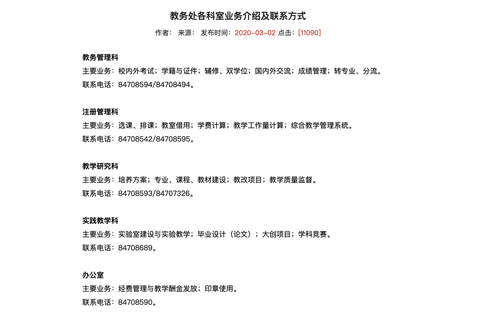

# Chapter 4 巧在大工·各类知识小分享

##  4.1 重要的联系方式

- 电信学部教务：🌈创新园大厦 a312  ☎️电话 0411-84708473 联系时间：工作日 8：00-17：00
- 学校教务
  - <figure markdown>
  { width="600" }
</figure>

##  4.2 重要的网站

###   4.2.1 教学类

- 教务网站：https://teach.dlut.edu.cn/index.htm
- 校园门户网站：https://portal.dlut.edu.cn/tp/view?m=up#act=portal/viewhome
- 校园 VPN：http://webvpn.dlut.edu.cn/login
- 校园邮箱：https://mail.dlut.edu.cn/
- 校园图书馆：http://www.lib.dlut.edu.cn/（知网+万方等数据库）
- 物理课程实验中心：http://phyedu.dlut.edu.cn/（课程作业 + 实验报告模板）
- 创新创业学院官网：https://chuangxin.dlut.edu.cn/（主要是比赛信息来源）
- 电信学部官网：http://ee.dlut.edu.cn/（保研 or 考研 or 夏令营通知）
- 论文查重：http://verify.wanfangdata.com.cn/

###   4.2.2 教材 or 电子书类

> 俗话说：磨刀不误砍柴工。如果你是一个刚刚接触计算机的24k纯小白，学会一些工具将会让你事半功倍。

学会提问：也许你会惊讶，提问也算计算机必备技能吗，还放在第一条？我觉得在开源社区中，学会提问是一项非常重要的能力，它包含两方面的事情。其一是会变相地培养你自主解决问题的能力，因为从形成问题、描述问题并发布、他人回答、最后再到理解回答这个周期是非常长的，如果遇到什么鸡毛蒜皮的事情都希望别人最好远程桌面手把手帮你完成，那计算机的世界基本与你无缘了。其二，如果真的经过尝试还无法解决，可以借助开源社区的帮助，但这时候如何通过简洁的文字让别人瞬间理解你的处境以及目的，就显得尤为重要。推荐阅读[提问的智慧](https://github.com/ryanhanwu/How-To-Ask-Questions-The-Smart-Way/blob/main/README-zh_CN.md)这篇文章，这不仅能提高你解决问题的概率和效率，也能让开源社区里无偿提供解答的人们拥有一个好心情。

[**翻墙**](必学工具/翻墙.md)：由于一些众所周知的原因，谷歌、GitHub 等网站在大陆无法访问。然而很多时候，谷歌和 StackOverflow 可以解决你在开发过程中遇到的 99% 的问题。因此，学会翻墙几乎是一个内地 CSer 的必备技能。（考虑到法律问题，这个文档提供的翻墙方式仅对拥有北大邮箱的用户适用）。

**命令行：**熟练使用命令行是一种常常被忽视，或被认为难以掌握的技能，但实际上，它会极大地提高你作为工程师的灵活性以及生产力。[命令行的艺术](https://github.com/jlevy/the-art-of-command-line/blob/master/README-zh.md)是一份非常经典的教程，它源于 Quora 的一个提问，但在各路大神的贡献努力下已经成为了一个 GitHub 十万 stars 的顶流项目，被翻译成了十几种语言。教程不长，非常建议大家反复通读，在实践中内化吸收。同时，掌握 Shell 脚本编程也是一项不容忽视的技术，可以参考这个[教程](https://www.shellscript.sh/)。

**IDE (Integrated Development Environment)：**集成开发环境，说白了就是你写代码的地方。作为一个码农，IDE 的重要性不言而喻，但由于很多 IDE 是为大型工程项目设计的，体量较大，功能也过于丰富。其实如今一些轻便的文本编辑器配合丰富的插件生态基本可以满足日常的轻量编程需求。个人常用的编辑器是 VS Code 和 Sublime（前者的插件配置非常简单，后者略显复杂但颜值很高）。当然对于大型项目我还是会采用略重型的 IDE，例如 Pycharm (Python)，IDEA (Java) 等等（免责申明：所有的 IDE 都是世界上最好的 IDE）。

**[Vim](必学工具/Vim.md)：**一款命令行编辑工具。这是一个学习曲线有些陡峭的编辑器，不过学会它我觉得是非常有必要的，因为它将极大地提高你的开发效率。现在绝大多数 IDE 也都支持 Vim 插件，让你在享受现代开发环境的同时保留极客的炫酷（yue）。

**[Emacs](必学工具/Emacs.md)：**与 Vim 齐名的经典编辑器，同样具有极高的开发效率，同时具有更为强大的扩展性，它既可以配置为一个轻量编辑器，也可以扩展成一个个人定制的 IDE，甚至可以有更多奇技淫巧。

**[Git](必学工具/Git.md)：**一款代码版本控制工具。Git的学习曲线可能更为陡峭，但出自 Linux 之父 Linus 之手的 Git 绝对是每个学 CS 的童鞋必须掌握的神器之一。

**[GitHub](必学工具/GitHub.md)：**基于 Git 的代码托管平台。全世界最大的代码开源社区，大佬集聚地。

**[GNU Make](必学工具/GNU_Make.md)**：一款工程构建工具。善用 GNU Make 会让你养成代码模块化的习惯，同时也能让你熟悉一些大型工程的编译链接流程。

**[CMake](必学工具/CMake.md)：**一款功能比 GNU Make 更为强大的构建工具，建议掌握 GNU Make 之后再加以学习。

**[LaTex](必学工具/LaTeX.md)：**<del>逼格提升</del> 论文排版工具。

**[Docker](必学工具/Docker.md)：**一款相较于虚拟机更轻量级的软件打包与环境部署工具。

**[实用工具箱](必学工具/tools.md)：**除了上面提到的这些在开发中使用频率极高的工具之外，我还收集了很多实用有趣的免费工具，例如一些下载工具、设计工具、学习网站等等。

**[Thesis](必学工具/thesis.md)：**毕业论文 Word 写作教程。

[**Zlibrary**](https://singlelogin.re/)：超级棒的电子书下载网站，不过需要科学上网哦～

##  4.3  PPT 材料

- 大工模板：https://mp.weixin.qq.com/s/_tY4-rAXfivCSY25UV4pMA
- Office 官网：https://www.officeplus.cn/
- 保研+考研 复试 PPT 模板 🈲️外传
  - 链接： https://pan.baidu.com/s/1VLrToFsiIcnSxGjP1qp3tw?pwd=ffff 提取码： ffff 
  - 文件框架
  - 

##    4.4 购买课程

###     4.4.1 机器人路径规划-高飞

​    链接：https://pan.baidu.com/s/1DyPROf7JqjWyoC-a-tgi7A?pwd=ffff 

###     4.4.2 机器学习数学基础

​    链接：https://pan.baidu.com/s/1Lnsq_HoJe4q9mod_zTS8ig?pwd=ffff 

###     4.4.3 ROS 学习（古月居）

​    链接：https://pan.baidu.com/s/16OFVNHzyMuOAV4aqSp0DOQ?pwd=ffff 

###     4.4.4 视觉 SLAM-高翔

​    链接：https://pan.baidu.com/s/1Hke3z-8GeWEzx597FBGWyQ?pwd=ffff 

